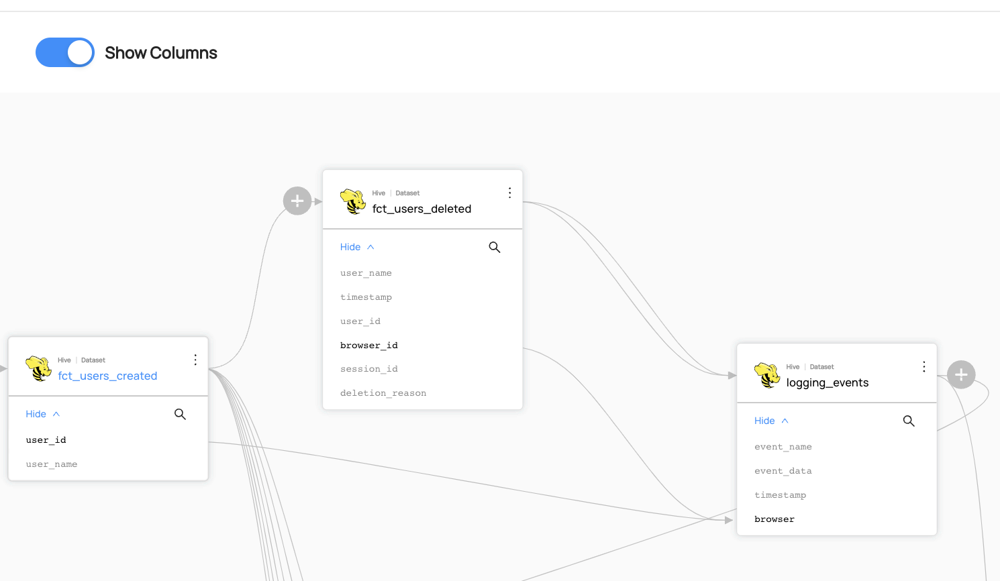

import Tabs from '@theme/Tabs';
import TabItem from '@theme/TabItem';

# Lineage

## Why Would You Use Lineage?

Lineage is used to capture data dependencies within an organization. It allows you to track the inputs from which a data asset is derived, along with the data assets that depend on it downstream.
For more information about lineage, refer to [About DataHub Lineage](/docs/lineage/lineage-feature-guide.md).

### Goal Of This Guide

This guide will show you how to

- Add lineage between datasets.
- Add column-level lineage between datasets.

## Prerequisites

For this tutorial, you need to deploy DataHub Quickstart and ingest sample data.
For detailed steps, please refer to [Datahub Quickstart Guide](/docs/quickstart.md).

:::note
Before adding lineage, you need to ensure the targeted dataset is already present in your datahub.
If you attempt to manipulate entities that do not exist, your operation will fail.
In this guide, we will be using data from sample ingestion.
:::

## Add Lineage

<Tabs>
<TabItem value="graphql" label="GraphQL" default>

```json
mutation updateLineage {
  updateLineage(
    input: {
      edgesToAdd: [
        {
          downstreamUrn: "urn:li:dataset:(urn:li:dataPlatform:hive,logging_events,PROD)"
          upstreamUrn: "urn:li:dataset:(urn:li:dataPlatform:hive,fct_users_deleted,PROD)"
        }
      ]
      edgesToRemove: []
    }
  )
}
```

Note that you can create a list of edges. For example, if you want to assign multiple upstream entities to a downstream entity, you can do the following.

```json
mutation updateLineage {
  updateLineage(
    input: {
      edgesToAdd: [
        {
          downstreamUrn: "urn:li:dataset:(urn:li:dataPlatform:hive,logging_events,PROD)"
          upstreamUrn: "urn:li:dataset:(urn:li:dataPlatform:hive,fct_users_deleted,PROD)"
        }
        {
          downstreamUrn: "urn:li:dataset:(urn:li:dataPlatform:hive,logging_events,PROD)"
          upstreamUrn: "urn:li:dataset:(urn:li:dataPlatform:hive,fct_users_created,PROD)"
        }
      ]
      edgesToRemove: []
    }
  )
}

```

For more information about the `updateLineage` mutation, please refer to [updateLineage](/docs/graphql/mutations/#updatelineage).

If you see the following response, the operation was successful:

```python
{
  "data": {
    "updateLineage": true
  },
  "extensions": {}
}
```

</TabItem>
<TabItem value="curl" label="Curl">

```shell
curl --location --request POST 'http://localhost:8080/api/graphql' \
--header 'Authorization: Bearer <my-access-token>' \
--header 'Content-Type: application/json'  --data-raw '{ "query": "mutation updateLineage { updateLineage( input:{ edgesToAdd : { downstreamUrn: \"urn:li:dataset:(urn:li:dataPlatform:hive,fct_users_deleted,PROD)\", upstreamUrn : \"urn:li:dataset:(urn:li:dataPlatform:hive,logging_events,PROD)\"}, edgesToRemove :{downstreamUrn: \"urn:li:dataset:(urn:li:dataPlatform:hive,fct_users_deleted,PROD)\",upstreamUrn : \"urn:li:dataset:(urn:li:dataPlatform:hive,fct_users_deleted,PROD)\" } })}", "variables":{}}'
```

Expected Response:

```json
{ "data": { "updateLineage": true }, "extensions": {} }
```

</TabItem>
<TabItem value="python" label="Python">

```python
# Inlined from /metadata-ingestion/examples/library/lineage_emitter_rest.py
import datahub.emitter.mce_builder as builder
from datahub.emitter.rest_emitter import DatahubRestEmitter

# Construct a lineage object.
lineage_mce = builder.make_lineage_mce(
    [
        builder.make_dataset_urn("hive", "fct_users_deleted"),  # Upstream
    ],
    builder.make_dataset_urn("hive", "logging_events"),  # Downstream
)

# Create an emitter to the GMS REST API.
emitter = DatahubRestEmitter("http://localhost:8080")

# Emit metadata!
emitter.emit_mce(lineage_mce)

```

</TabItem>
</Tabs>

### Expected Outcomes of Adding Lineage

You can now see the lineage between `fct_users_deleted` and `logging_events`.


## Add Column-level Lineage

<Tabs>
<TabItem value="python" label="Python">

```python
# Inlined from /metadata-ingestion/examples/library/lineage_emitter_dataset_finegrained_sample.py
import datahub.emitter.mce_builder as builder
from datahub.emitter.mcp import MetadataChangeProposalWrapper
from datahub.emitter.rest_emitter import DatahubRestEmitter
from datahub.metadata.com.linkedin.pegasus2avro.dataset import (
    DatasetLineageType,
    FineGrainedLineage,
    FineGrainedLineageDownstreamType,
    FineGrainedLineageUpstreamType,
    Upstream,
    UpstreamLineage,
)


def datasetUrn(tbl):
    return builder.make_dataset_urn("hive", tbl)


def fldUrn(tbl, fld):
    return builder.make_schema_field_urn(datasetUrn(tbl), fld)


fineGrainedLineages = [
    FineGrainedLineage(
        upstreamType=FineGrainedLineageUpstreamType.FIELD_SET,
        upstreams=[
            fldUrn("fct_users_deleted", "browser_id"),
            fldUrn("fct_users_created", "user_id"),
        ],
        downstreamType=FineGrainedLineageDownstreamType.FIELD,
        downstreams=[fldUrn("logging_events", "browser")],
    ),
]


# this is just to check if any conflicts with existing Upstream, particularly the DownstreamOf relationship
upstream = Upstream(
    dataset=datasetUrn("fct_users_deleted"), type=DatasetLineageType.TRANSFORMED
)

fieldLineages = UpstreamLineage(
    upstreams=[upstream], fineGrainedLineages=fineGrainedLineages
)

lineageMcp = MetadataChangeProposalWrapper(
    entityUrn=datasetUrn("logging_events"),
    aspect=fieldLineages,
)

# Create an emitter to the GMS REST API.
emitter = DatahubRestEmitter("http://localhost:8080")

# Emit metadata!
emitter.emit_mcp(lineageMcp)

```

</TabItem>
</Tabs>

### Expected Outcome of Adding Column Level Lineage

You can now see the column-level lineage between datasets. Note that you have to enable `Show Columns` to be able to see the column-level lineage.



## Read Lineage

<Tabs>
<TabItem value="graphql" label="GraphQL" default>

```json
mutation searchAcrossLineage {
  searchAcrossLineage(
    input: {
      query: "*"
      urn: "urn:li:dataset:(urn:li:dataPlatform:dbt,long_tail_companions.adoption.human_profiles,PROD)"
      start: 0
      count: 10
      direction: DOWNSTREAM
      orFilters: [
        {
          and: [
            {
              condition: EQUAL
              negated: false
              field: "degree"
              values: ["1", "2", "3+"]
            }
          ]
        }
      ]
    }
  ) {
    searchResults {
      degree
      entity {
        urn
        type
      }
    }
  }
}
```

This example shows using lineage degrees as a filter, but additional search filters can be included here as well.

</TabItem>
<TabItem value="curl" label="Curl">

```shell
curl --location --request POST 'http://localhost:8080/api/graphql' \
--header 'Authorization: Bearer <my-access-token>' \
--header 'Content-Type: application/json'  --data-raw '{ { "query": "mutation searchAcrossLineage { searchAcrossLineage( input: { query: \"*\" urn: \"urn:li:dataset:(urn:li:dataPlatform:dbt,long_tail_companions.adoption.human_profiles,PROD)\" start: 0 count: 10 direction: DOWNSTREAM orFilters: [ { and: [ { condition: EQUAL negated: false field: \"degree\" values: [\"1\", \"2\", \"3+\"] } ] } ] } ) { searchResults { degree entity { urn type } } }}"
}}'
```

</TabItem>
<TabItem value="python" label="Python">

```python
# Inlined from /metadata-ingestion/examples/library/read_lineage_rest.py
# read-modify-write requires access to the DataHubGraph (RestEmitter is not enough)
from datahub.ingestion.graph.client import DatahubClientConfig, DataHubGraph

gms_endpoint = "http://localhost:8080"
graph = DataHubGraph(DatahubClientConfig(server=gms_endpoint))

# Query multiple aspects from entity
query = """
mutation searchAcrossLineage {
  searchAcrossLineage(
    input: {
      query: "*"
      urn: "urn:li:dataset:(urn:li:dataPlatform:dbt,long_tail_companions.adoption.human_profiles,PROD)"
      start: 0
      count: 10
      direction: DOWNSTREAM
      orFilters: [
        {
          and: [
            {
              condition: EQUAL
              negated: false
              field: "degree"
              values: ["1", "2", "3+"]
            }
          ]                                     # Additional search filters can be included here as well
        }
      ]
    }
  ) {
    searchResults {
      degree
      entity {
        urn
        type
      }
    }
  }
}
"""
result = graph.execute_graphql(query=query)

print(result)

```

</TabItem>
</Tabs>

This will perform a multi-hop lineage search on the urn specified. For more information about the `searchAcrossLineage` mutation, please refer to [searchAcrossLineage](/docs/graphql/queries/#searchacrosslineage).
