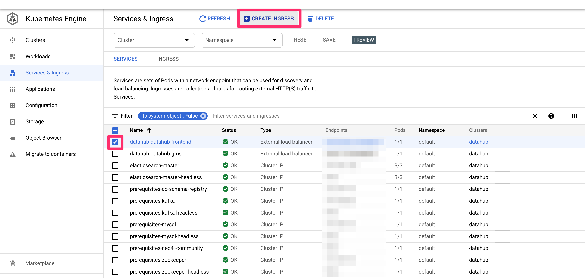
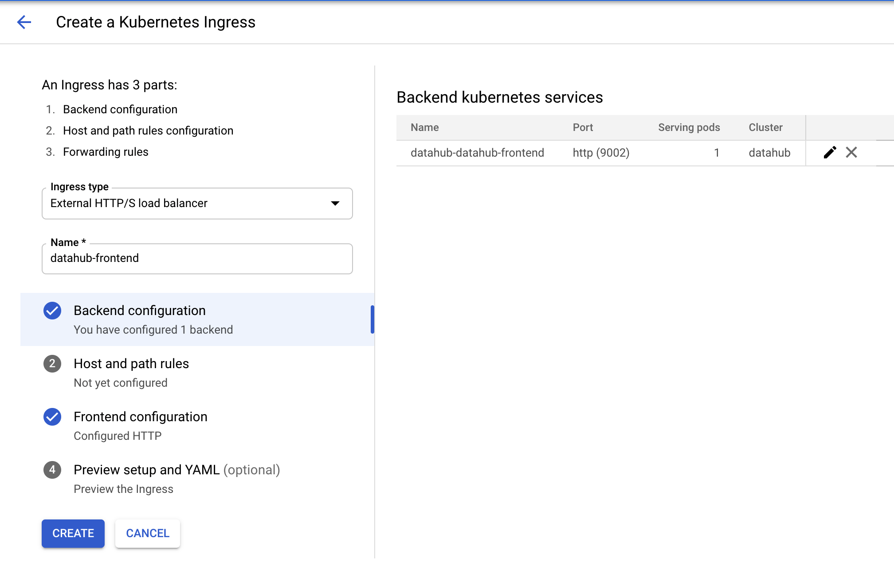
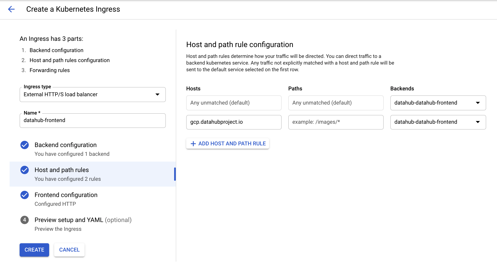
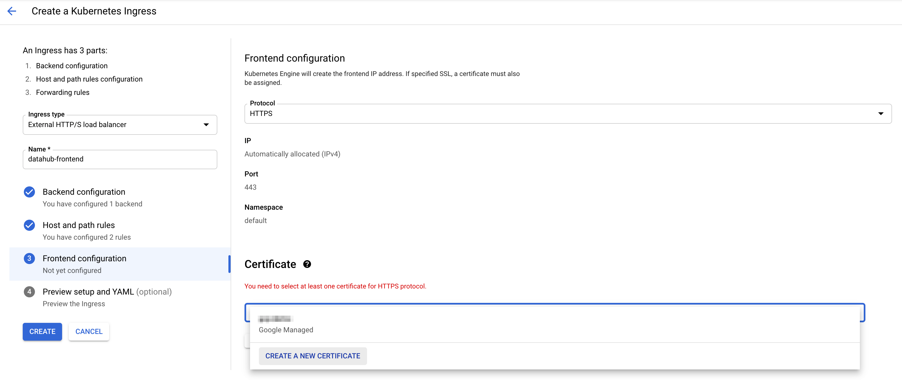
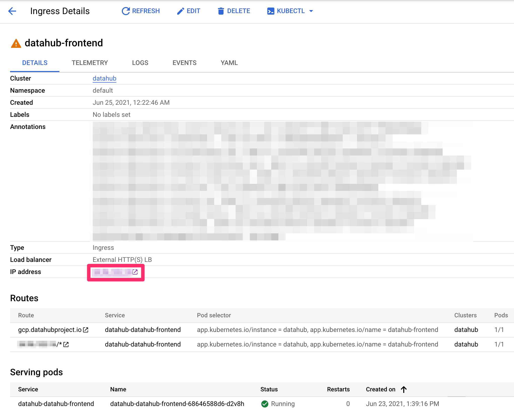

# GCP setup guide

The following is a set of instructions to quickstart DataHub on GCP Google Kubernetes Engine (GKE). Note, the guide
assumes that you do not have a kubernetes cluster set up. If you are deploying DataHub to an existing cluster, please
skip the corresponding sections.

## Prerequisites

This guide requires the following tools:

- [kubectl](https://kubernetes.io/docs/tasks/tools/) to manage kubernetes resources
- [helm](https://helm.sh/docs/intro/install/) to deploy the resources based on helm charts. Note, we only support Helm 3.
- [gcloud](https://cloud.google.com/sdk/docs/install) to manage GCP resources

Follow the
following [guide](https://cloud.google.com/kubernetes-engine/docs/how-to/creating-a-zonal-cluster#before_you_begin) to
correctly set up Google Cloud SDK.

After setting up, run `gcloud services enable container.googleapis.com` to make sure GKE service is enabled.

## Start up a kubernetes cluster on GKE

Let’s follow this [guide](https://cloud.google.com/kubernetes-engine/docs/how-to/creating-a-zonal-cluster) to create a
new cluster using gcloud. Run the following command with cluster-name set to the cluster name of choice, and zone set to
the GCP zone you are operating on.

```
gcloud container clusters create <<cluster-name>> \
    --zone <<zone>> \
    -m e2-standard-2
```

The command will provision a GKE cluster powered by 3 e2-standard-2 (2 CPU, 8GB RAM) nodes.

If you are planning to run the storage layer (MySQL, Elasticsearch, Kafka) as pods in the cluster, you need at least 3
nodes with the above specs. If you decide to use managed storage services, you can reduce the number of nodes or use
m3.medium nodes to save cost. Refer to
this [guide](https://cloud.google.com/kubernetes-engine/docs/how-to/creating-a-regional-cluster) for creating a regional
cluster for better robustness.

Run `kubectl get nodes` to confirm that the cluster has been setup correctly. You should get results like below

```
NAME                                     STATUS   ROLES    AGE   VERSION
gke-datahub-default-pool-e5be7c4f-8s97   Ready    <none>   34h   v1.19.10-gke.1600
gke-datahub-default-pool-e5be7c4f-d68l   Ready    <none>   34h   v1.19.10-gke.1600
gke-datahub-default-pool-e5be7c4f-rksj   Ready    <none>   34h   v1.19.10-gke.1600
```

## Setup DataHub using Helm

Once the kubernetes cluster has been set up, you can deploy DataHub and it’s prerequisites using helm. Please follow the
steps in this [guide](kubernetes.md)

## Expose endpoints using GKE ingress controller

Now that all the pods are up and running, you need to expose the datahub-frontend end point by setting
up [ingress](https://kubernetes.io/docs/concepts/services-networking/ingress/). Easiest way to set up ingress is to use
the GKE page on [GCP website](https://console.cloud.google.com/kubernetes/discovery).

Once all deploy is successful, you should see a page like below in the "Services & Ingress" tab on the left.



Tick the checkbox for datahub-datahub-frontend and click "CREATE INGRESS" button. You should land on the following page.



Type in an arbitrary name for the ingress and click on the second step "Host and path rules". You should land on the
following page.



Select "datahub-datahub-frontend" in the dropdown menu for backends, and then click on "ADD HOST AND PATH RULE" button.
In the second row that got created, add in the host name of choice (here gcp.datahubproject.io) and select
"datahub-datahub-frontend" in the backends dropdown.

This step adds the rule allowing requests from the host name of choice to get routed to datahub-frontend service. Click
on step 3 "Frontend configuration". You should land on the following page.



Choose HTTPS in the dropdown menu for protocol. To enable SSL, you need to add a certificate. If you do not have one,
you can click "CREATE A NEW CERTIFICATE" and input the host name of choice. GCP will create a certificate for you.

Now press "CREATE" button on the left to create ingress! After around 5 minutes, you should see the following.



In your domain provider, add an A record for the host name set above using the IP address on the ingress page (noted
with the red box). Once DNS updates, you should be able to access DataHub through the host name!!

Note, ignore the warning icon next to ingress. It takes about ten minutes for ingress to check that the backend service
is ready and show a check mark as follows. However, ingress is fully functional once you see the above page.


