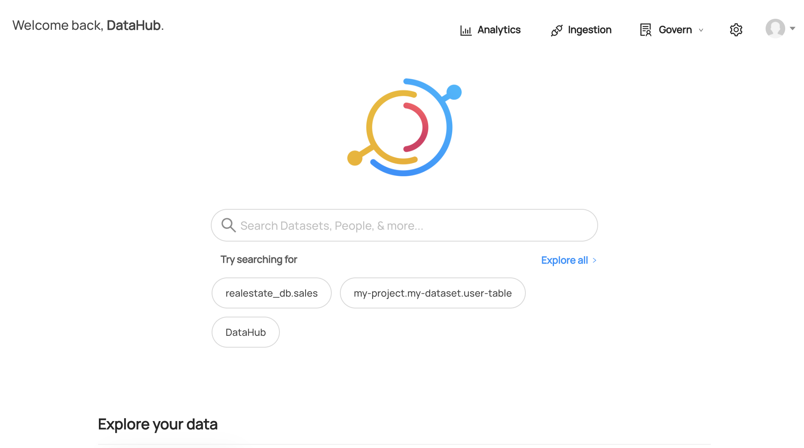
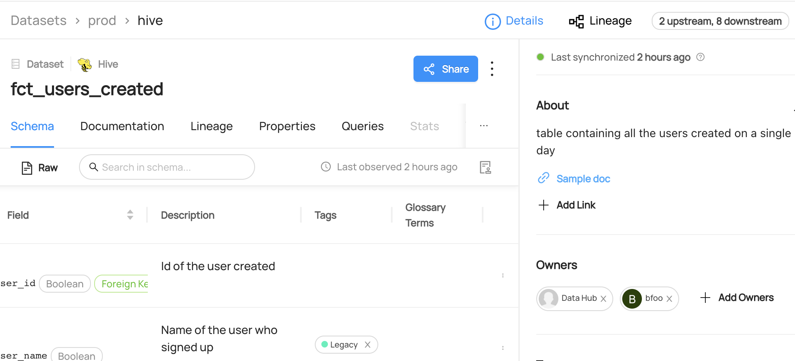

# Adding Ownerships

## Why Would You Add Ownerships? 
Ownerships are something you can ~~~. You can do 
* This
* That

Fore more information about ownerships, refer to [About Datahub Ownerships](https://datahubproject.io/docs/ownerships/).

## Pre-requisites

### Deploy Datahub Quickstart 
You need a datahub running in local environment. First, install acryl-datahub if you did't yet. 
```shell
python3 -m pip install --upgrade pip wheel setuptools
python3 -m pip install --upgrade acryl-datahub
```
If you can see datahub version like this, you're good to go. 
```shell
$ datahub version
DataHub CLI version: 0.10.0.1
Python version: 3.9.6 (default, Jun 16 2022, 21:38:53)
[Clang 13.0.0 (clang-1300.0.27.3)]
```

Run datahub quickstart. This will deploy local datahub server to http://localhost:9002 
```shell
datahub docker quickstart
```
After logging in with the default credential(`username: datahub / password: datahub`), you can see Datahub ready for you. 



Please refer to [DataHub Quickstart Guide](https://datahubproject.io/docs/quickstart) for more information. 

### Ingest Sample Data
We will use sample data provided with datahub quickstart. 
If you already have data on your datahub, you might skip this part. 

```shell
datahub docker ingest-sample-data 
```
This will ingest various entities like datasets, terms and ownerships to your local Datahub.


## Example Usage

:::note
Adding ownerships assumes that you already have a dataset and ownerships on your datahub.
If you try to manipulate with entities that does not exist, it might return errors or failed to reference them.
:::


### Add Ownerships With Python SDK

Following codes add an owner named `bfoo` to a hive dataset named `fct_users_created`.
You can refer to a full code in [dataset_add_column_ownership.py](https://github.com/datahub-project/datahub/blob/master/metadata-ingestion/examples/library/dataset_add_owner.py).
```python
# inlined from metadata-ingestion/examples/library/dataset_add_column_ownership.py
import logging
from typing import Optional

from datahub.emitter.mce_builder import make_dataset_urn, make_user_urn
from datahub.emitter.mcp import MetadataChangeProposalWrapper

# read-modify-write requires access to the DataHubGraph (RestEmitter is not enough)
from datahub.ingestion.graph.client import DatahubClientConfig, DataHubGraph

# Imports for metadata model classes
from datahub.metadata.schema_classes import (
    OwnerClass,
    OwnershipClass,
    OwnershipTypeClass,
)

log = logging.getLogger(__name__)
logging.basicConfig(level=logging.INFO)


# Inputs -> owner, ownership_type, dataset
owner_to_add = make_user_urn("bfoo")
ownership_type = OwnershipTypeClass.TECHNICAL_OWNER
dataset_urn = make_dataset_urn(platform="hive", name="fct_users_created", env="PROD")

# Some objects to help with conditional pathways later
owner_class_to_add = OwnerClass(owner=owner_to_add, type=ownership_type)
ownership_to_add = OwnershipClass(owners=[owner_class_to_add])


# First we get the current owners
gms_endpoint = "http://localhost:8080"
graph = DataHubGraph(DatahubClientConfig(server=gms_endpoint))


current_owners: Optional[OwnershipClass] = graph.get_aspect(
    entity_urn=dataset_urn, aspect_type=OwnershipClass
)


need_write = False
if current_owners:
    if (owner_to_add, ownership_type) not in [
        (x.owner, x.type) for x in current_owners.owners
    ]:
        # owners exist, but this owner is not present in the current owners
        current_owners.owners.append(owner_class_to_add)
        need_write = True
else:
    # create a brand new ownership aspect
    current_owners = ownership_to_add
    need_write = True

if need_write:
    event: MetadataChangeProposalWrapper = MetadataChangeProposalWrapper(
        entityUrn=dataset_urn,
        aspect=current_owners,
    )
    graph.emit(event)
    log.info(
        f"Owner {owner_to_add}, type {ownership_type} added to dataset {dataset_urn}"
    )

else:
    log.info(f"Owner {owner_to_add} already exists, omitting write")
```

### Add Ownerships With GraphQL

There are several ways to do it with GraphQL : GraphQL Explorer, HTTP CURL, Postman or GraphQL SDKs. 

#### GraphQL Explorer
Navigate to GraphQL Explorer (`http://localhost:9002/api/graphiql`) and run the following query.

```python
mutation addOwners {
    addOwner(
      input: { 
        ownerUrn: "urn:li:corpGroup:bfoo", 
        resourceUrn: "urn:li:dataset:(urn:li:dataPlatform:hive,fct_users_created,PROD)",
        ownerEntityType: CORP_GROUP,
        type: TECHNICAL_OWNER
			}
    )
}
```
You are succeeded if you see the following response.
```python
{
  "data": {
    "addOwner": true
  },
  "extensions": {}
}
```

#### CURL

With CURL, you need to provide tokens. To generate token, please refer [Generate Access Token](http://localhost:3000/docs/dev-guides/tutorials/generate-access-token). 
With `accessToken`, you can run the following command.

```shell
curl --location --request POST 'http://localhost:8080/api/graphql' \
--header 'Authorization: Bearer <my-access-token>' \
--header 'Content-Type: application/json' \
--data-raw '{ "query": "mutation addOwners { addOwner(input: { ownerUrn: \"urn:li:corpGroup:bfoo\", resourceUrn: \"urn:li:dataset:(urn:li:dataPlatform:hive,fct_users_created,PROD)\", ownerEntityType: CORP_GROUP, type: TECHNICAL_OWNER }) }", "variables":{}}'
```

Expected Response:
```json
{"data":{"addOwner":true},"extensions":{}}
```


## Expected Outcomes
You can now see `bffo` has been added as an owner to `fct_users_created` dataset.




## What’s Next

