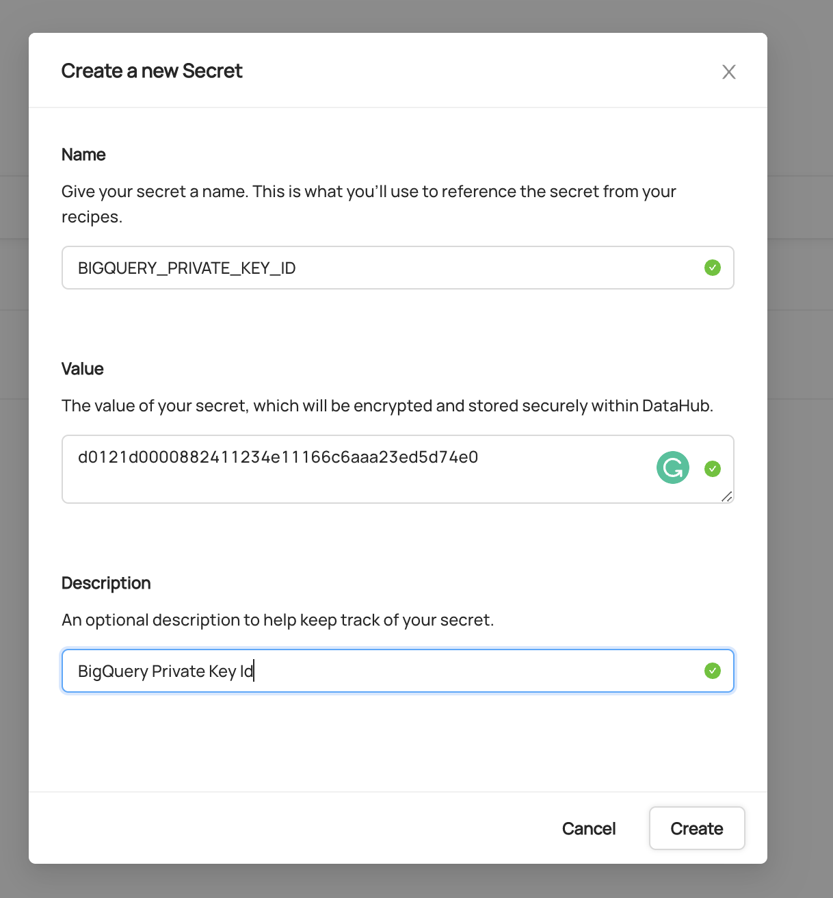
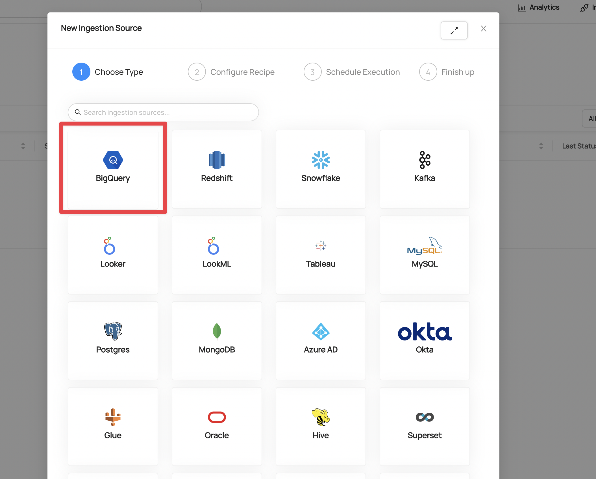
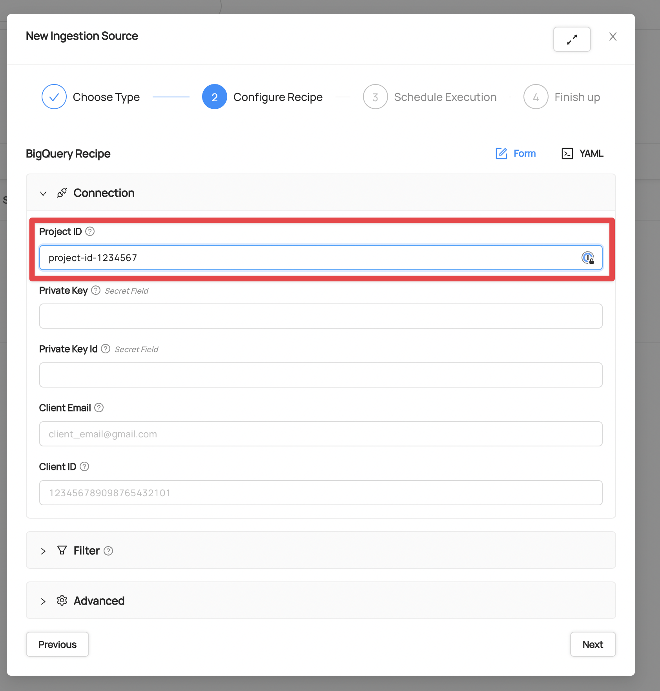
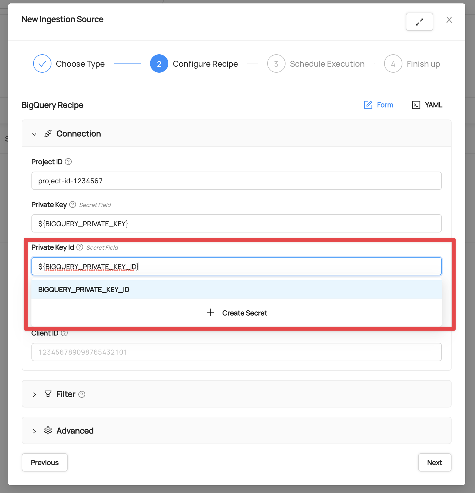
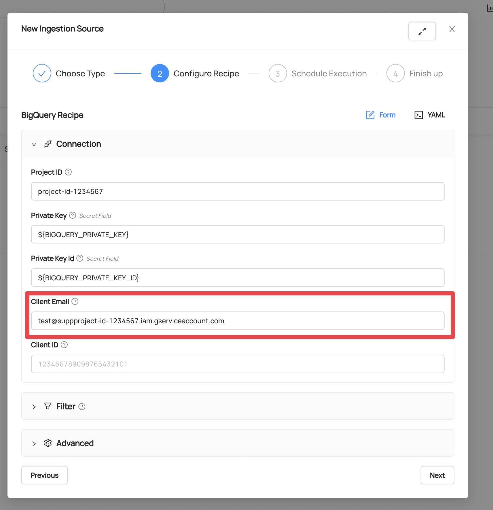
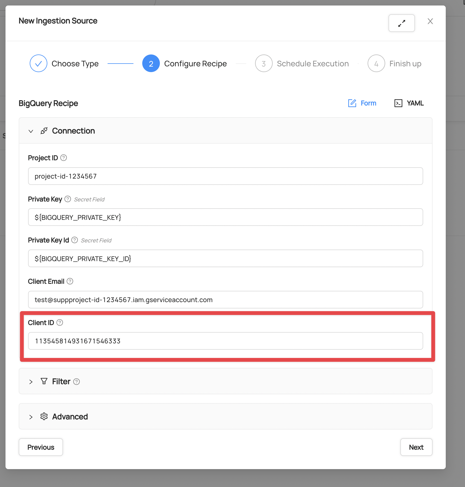
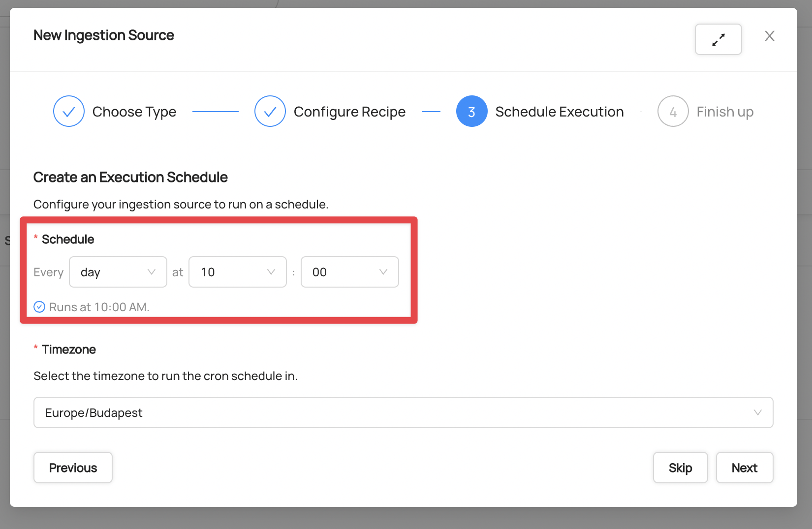
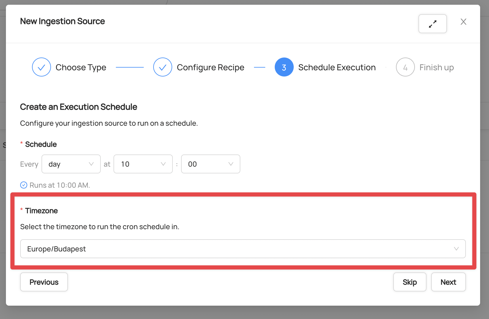
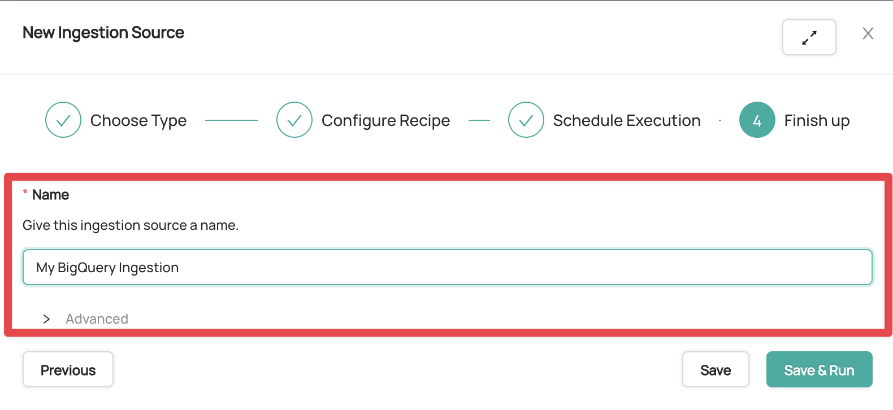
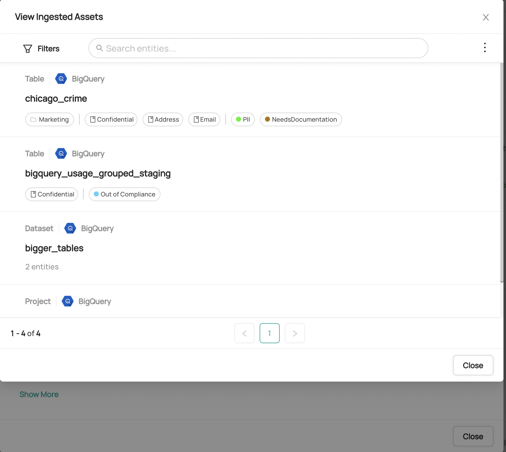

# DataHub [BigQuery] UI Ingestion Guide: Configuring Your [BigQuery] to DataHub Connector

## UI Ingestion

* Navigate to the "Ingestion Tab"

## Step 1: Configure Secrets
1. Select `Secrets tab`

3. Add from Service Account Key's `Private Key` as secret:
   * Click on `Create new secret` button
   * Enter a name like `BIGQUERY_PRIVATE_KEY` to the secret which is used to refer to this secret in the future
   * Copy/Paste the Private Key value from your Service Account Key
   * Optionally add a description

5. Add from Service Account Key's `Private Key Id` as secret:
   * Click on `Create new secret` button
   * Enter a name like `BIGQUERY_PRIVATE_KEY_ID` to the secret which is used to refer to this secret in the future
   * Copy/Paste the Private Key Id value from your Service Account Key
   * Optionally add a description

## Step 2: Configure Recipe
* Click "Create new source"

* Select BigQuery from the options

* Using the Project Id/Private key/Private Key Id you noted down during the prerequesites, fill out X field with Y information
1. Enter from Service Account Key's `project_id` to `project_id` field:

2. Add the previously added `Private Key` secret to `Private Key` field:
   * Click on the `Private Key` input field
   * Select `BIGQUERY_PRIVATE_KEY` secret

3. Add the previousl added `Private Key Id` secret to `Private Key Id` field:
   * Click on the `Private Key Id` input field
   * Select `BIGQUERY_PRIVATE_KEY_ID` secret

4. Copy/Paste Service Account Key's `client_email` to `Client Email` field:

5. Copy/Paste Service Account Key's `client_id` to `Client Id` field:

6. Click `Next` when you are done

## Step 3: Schedule Execution

* Decide how regularly you want this ingestion to run-- day, month, year, hour, minute, etc. Select from the dropdown

* Ensure you've configured your correct timezone.

* Click `Next` when you are done.

## Step 4: Finish Up
* Name your ingestion source.

* Click `Save & Run`.
* Now you should see your ingestion job running

## Validating Your Ingestion Run
* Review the "Manage Ingestion" Page to ensure that your ingestion job has executed with status `succeeded`

* Click on the `+` icon on the left of the ingestion to expand the run history
* Click on `Details` to see the ingestion summary page

* Click on `View all` to see all the ingested assets

* Pick one and validate if it was ingested correctly

* Congratulations! You've successful set up [BigQuery] as an ingestion source for DataHub!

## FAQ and Troubleshooting

<!-- This section should appear below the fold (collapsed dropdown), and should address next steps if the user is unable to complete a prerequesite due to permissions etc. 

**Question in bold text**

Response in plain text

-->
## Video Walkthrough

<!-- Use the following format to embed YouTube videos:

**Title of YouTube video in bold text**

<iframe width="560" height="315" src="www.youtube.com/embed/VIDEO_ID" title="YouTube video player" frameborder="0" allow="accelerometer; autoplay; clipboard-write; encrypted-media; gyroscope; picture-in-picture" allowfullscreen></iframe>

 

-->

<!-- 
NOTE: Find the iframe details in YouTube by going to Share > Embed 
 -->

## Next Steps
<!-- Now that you've completed our [Source] ingestion guide, why not try ingesting another stage of your data pipeline, or attempt a more advanced configuration? -->

### Guides on Ingesting Other Sources

### Advanced Guides

*Need more help? Join the conversation in [Slack](http://slack.datahubproject.io)!*